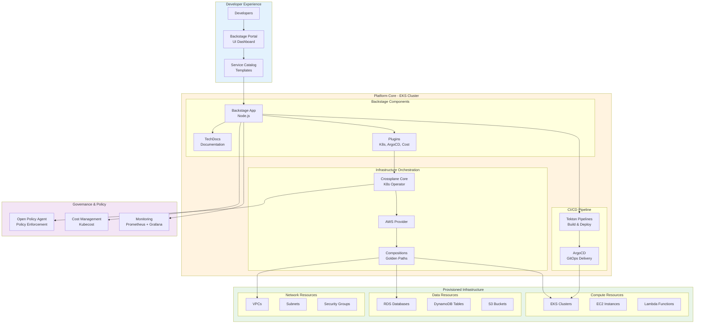

# 🚀 Internal Developer Platform

> **Self-service platform** for developers with Backstage, Crossplane, service catalog, and automated provisioning

[](https://www.terraform.io/)
[](https://backstage.io/)
[](https://www.crossplane.io/)
[](https://kubernetes.io/)

## 🎯 Overview

Enterprise Internal Developer Platform (IDP) that empowers developers with self-service capabilities, golden paths, and automated infrastructure provisioning. Built on Backstage for the developer portal and Crossplane for infrastructure orchestration.

**Use Case**: Enable developers to provision infrastructure, deploy applications, and manage services through a unified portal without waiting for operations teams.

**Technology Stack**: Terraform, Kubernetes (EKS), Backstage.io, Crossplane, ArgoCD, Tekton Pipelines

---

## 🏗️ Architecture

### High-Level Architecture



---

## ✨ Key Features

### **Developer Portal (Backstage)**
- Unified service catalog
- Software templates (scaffolding)
- TechDocs documentation
- Plugin ecosystem (Kubernetes, ArgoCD, Cost)
- Search across all services
- API documentation

### **Infrastructure as Code (Crossplane)**
- Declarative infrastructure provisioning
- Composition of cloud resources
- Self-service resource claims
- Multi-cloud support (AWS, Azure, GCP)
- Drift detection and reconciliation
- Resource lifecycle management

### **Golden Paths & Templates**
- Pre-approved infrastructure patterns
- Microservice templates
- Database provisioning templates
- Networking templates
- Security-compliant by default
- One-click provisioning

### **CI/CD Integration**
- Tekton Pipelines for builds
- ArgoCD for deployments
- Automated testing
- Progressive delivery
- Environment promotion
- Rollback capabilities

### **Governance & Compliance**
- Policy enforcement with OPA
- Cost tracking and budgets
- Resource quotas
- RBAC and permissions
- Audit logging
- Compliance dashboards

---

## 📦 Project Structure

```
internal-developer-platform/
├── terraform/
│   ├── main.tf                         # Main Terraform config
│   ├── eks.tf                          # EKS cluster
│   ├── backstage.tf                    # Backstage deployment
│   ├── crossplane.tf                   # Crossplane installation
│   └── monitoring.tf                   # Monitoring stack
├── backstage/
│   ├── app-config.yaml                 # Backstage configuration
│   ├── catalog-info.yaml               # Service catalog
│   ├── templates/
│   │   ├── microservice-template/      # Microservice scaffold
│   │   ├── database-template/          # Database provisioning
│   │   └── frontend-template/          # Frontend app template
│   └── plugins/
│       ├── kubernetes/                 # K8s plugin config
│       └── cost/                       # Cost plugin config
├── crossplane/
│   ├── providers/
│   │   └── aws-provider.yaml           # AWS provider config
│   ├── compositions/
│   │   ├── vpc-composition.yaml        # VPC composition
│   │   ├── eks-composition.yaml        # EKS composition
│   │   └── rds-composition.yaml        # RDS composition
│   └── claims/
│       └── examples/                   # Example resource claims
├── policies/
│   ├── opa/                            # OPA policies
│   └── rbac/                           # RBAC configurations
└── docs/
    ├── ARCHITECTURE.md                 # Architecture details
    ├── DEVELOPER-GUIDE.md              # Developer onboarding
    └── PLATFORM-GUIDE.md               # Platform operations
```

---

## 🚀 Quick Start

### Prerequisites

- AWS CLI configured
- Terraform 1.5+
- kubectl and helm
- Docker

### Deploy Platform

```bash
# Deploy EKS cluster and platform components
cd terraform
terraform init
terraform apply

# Configure kubectl
aws eks update-kubeconfig --name developer-platform

# Access Backstage portal
kubectl port-forward svc/backstage -n backstage 7000:80

# Navigate to http://localhost:7000
```

### Developer Onboarding

```bash
# 1. Access Backstage portal
# 2. Navigate to "Create" → "Choose a template"
# 3. Select "Microservice Template"
# 4. Fill in service details
# 5. Click "Create" - Infrastructure provisioned automatically
```

---

## 🛠️ Service Templates

### 1. **Microservice Template**
Provisions:
- EKS namespace
- Service account with IAM role
- RDS PostgreSQL database
- S3 bucket for assets
- CI/CD pipeline
- Monitoring dashboards

### 2. **Frontend Application**
Provisions:
- S3 bucket for static hosting
- CloudFront distribution
- Route 53 DNS record
- CI/CD pipeline
- SSL certificate

### 3. **Data Pipeline**
Provisions:
- Airflow environment
- S3 data lake buckets
- Glue ETL jobs
- Athena workgroup
- QuickSight dashboard

---

## 📊 Self-Service Capabilities

| Resource Type | Provision Time | Self-Service | Approval Required |
|---------------|----------------|--------------|-------------------|
| Development Environment | 5 minutes | ✅ Yes | ❌ No |
| RDS Database | 10 minutes | ✅ Yes | ❌ No |
| EKS Cluster | 20 minutes | ✅ Yes | ✅ Yes (Production) |
| S3 Bucket | 1 minute | ✅ Yes | ❌ No |
| Lambda Function | 2 minutes | ✅ Yes | ❌ No |

---

## 💰 Cost Management

### Platform Costs

| Component | Monthly Cost |
|-----------|--------------|
| EKS Control Plane | $72 |
| Worker Nodes (3x t3.large) | $190 |
| Backstage (2 replicas) | $60 |
| Crossplane | $0 (controller only) |
| Monitoring Stack | $50 |
| Load Balancers | $50 |
| **Total Platform** | **~$422/month** |

### Per-Developer Costs
- Development Environment: ~$50/month
- Shared Services: ~$20/month/dev

---

## 🔐 Security Features

- ✅ **IAM Roles for Service Accounts (IRSA)**
- ✅ **Pod Security Standards enforcement**
- ✅ **Network policies by default**
- ✅ **Secrets managed via AWS Secrets Manager**
- ✅ **OPA policy enforcement**
- ✅ **Image scanning with Trivy**
- ✅ **RBAC with SSO integration**

---

## 📈 Metrics & Monitoring

### Platform Health Metrics
- Service provisioning success rate
- Average provisioning time
- Resource utilization
- Cost per service
- Developer satisfaction score

### Dashboards
1. **Platform Overview** - Health, usage, costs
2. **Service Catalog** - All services and owners
3. **Cost Dashboard** - Spend by team/service
4. **Performance** - Latency, throughput
5. **Security** - Vulnerabilities, compliance

---

## 🎓 Developer Experience Benefits

### Before IDP
- ❌ Wait 2-3 days for infrastructure
- ❌ Manual tickets and approvals
- ❌ Inconsistent configurations
- ❌ No visibility into costs
- ❌ Complex deployment process

### After IDP
- ✅ Self-service in minutes
- ✅ Automated provisioning
- ✅ Standardized golden paths
- ✅ Real-time cost visibility
- ✅ One-click deployments

---

## 🧪 Testing

```bash
# Validate Terraform
terraform validate

# Test Crossplane compositions
kubectl apply -f crossplane/claims/examples/test-vpc.yaml

# Verify Backstage health
curl -f http://localhost:7000/healthcheck

# Run integration tests
./scripts/test-platform.sh
```

---

## 📚 Documentation

- [Architecture Overview](docs/ARCHITECTURE.md)
- [Developer Guide](docs/DEVELOPER-GUIDE.md)
- [Platform Operations](docs/PLATFORM-GUIDE.md)
- [Troubleshooting](docs/TROUBLESHOOTING.md)

---

## 🎯 Use Cases

1. **Rapid Prototyping** - Spin up environments in minutes
2. **Standardization** - Enforce best practices automatically
3. **Cost Control** - Track and optimize cloud spend
4. **Compliance** - Built-in security and governance
5. **Developer Productivity** - Reduce operational overhead

---

**Author**: Rahul Ladumor  
**Email**: rahuldladumor@gmail.com  
**Portfolio**: [acloudwithrahul.in](https://acloudwithrahul.in)  
**License**: MIT 2025
